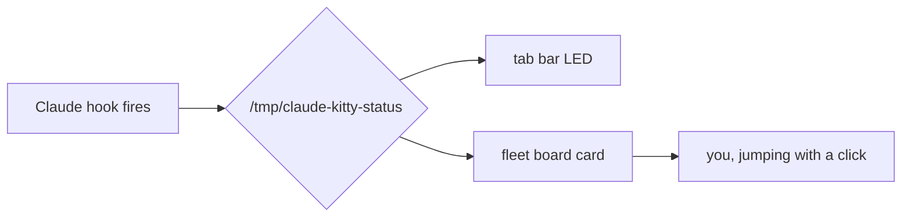

# ᓚᘏᗢ Nekotron Markdown Showcase

One document, four renderers: `mdv` (images + diagrams), `md` (pager),
`slides` (presentation — `---` breaks are slide breaks), `md-shot` (PNG).

Rendered by **glow** with the *Nekotron* glamour style — no literal `##`
in sight, ~~unstyled headers~~, and typeset `code spans`.

---

## Text, lists, and tasks

- **Bold claims** and *amber emphasis*
- A [link to the repo](https://github.com/DMHoodoo/nekotron)
- Nested:
  - `q` — sub-second local answers
  - `qa` — agentic crush lane

Task state:

- [x] hover-peek shelved
- [ ] hover-peek, the reckoning

> Blockquotes get the dim italic treatment — good for pull-quotes
> and hard-won lessons.

---

## Code

```python
def fleet_mode(cards):
    """The cat reflects the fleet."""
    working = sum(c["state"] == "working" for c in cards)
    return ("walk", f"hunting · {working} working") if working else ("sit", "satisfied")
```

```bash
cat error.log | q what broke   # local model, zero quota
```

---

## Tables

| Tool     | Latency | Quota cost |
|----------|---------|------------|
| `q`      | ~1s     | zero       |
| `qa`     | ~40s    | zero       |
| Claude   | varies  | real       |

---

## Inline images (mdv only)

The dusk diorama, baked by the fleet board's own art engine:


---

## Mermaid (mdv only)



---

## The end

Same file, try: `mdv docs/showcase.md` · `slides docs/showcase.md` ·
`md-shot docs/showcase.md` · `docs` in this repo.
